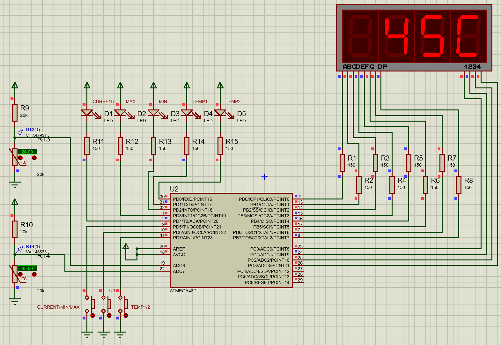

Для задания:

Собрать схему термометра с двумя датчиками, используя в качестве датчика температуры терморезистор, вывод данных реализовать на семи сегментный индикатор типа 7SEG-BCD. Для отображения температуры задействовать 4 разряда. На схеме предусмотреть кнопку переключающую режим отображения температуры (С\F), кнопку переключения между датчиками, вывод минимальной и максимальной температуры.

